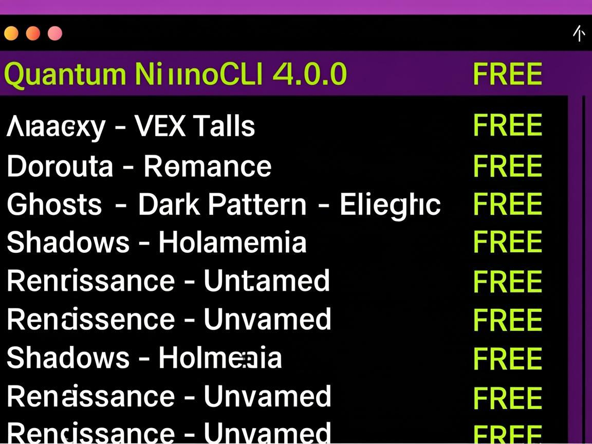

<p align="center">
  
  
  
  
</p>

<h1 align="center">NeuroCLI v4.0</h1>

<p align="center">
  
</p>

<p align="center"><strong>Advanced AI Terminal Coding Assistant</strong></p>

<p align="center">
  Multi-agent orchestration • Sub-agent spawning • ACP protocol • OS-level sandboxing<br>
  Spec-driven development • Smart monitoring • Multi-model routing • 23+ free models
</p>

---

## What's New in v4.0

| System | Description |
|--------|-------------|
| **Sub-Agent Spawning** | Hierarchical agent delegation with scoped tool access, file restrictions, and resource limits |
| **ACP Protocol** | Agent Client Protocol — "LSP for AI agents" — enables IDE integration (VS Code, Zed, JetBrains) |
| **OS-Level Sandbox** | Docker-based and native OS sandboxing with network isolation, command filtering, and audit logging |
| **Spec-Driven Development** | Generate requirements → design → implementation plan → code → verification pipeline |
| **LLM Evaluator Hooks** | Hooks that invoke LLM-based evaluators to approve/deny/modify actions in real-time |
| **MCP Apps** | Interactive tool UI extensions — forms, tables, charts, progress bars in terminal |
| **Multi-Model Orchestrator** | Orchestrator/worker pattern — expensive planner + cheap executor = 50-70% cost savings |
| **Smart Monitor** | LLM-based action evaluation bridging manual and auto mode with risk scoring |
| **Outcome Grading** | Rubric-based quality evaluation with revision loops and isolated evaluator |
| **OpenTelemetry** | Standard observability — OTLP traces/metrics export to Datadog, Jaeger, Grafana |
| **Auto-Compact** | Model-aware automatic context compaction when approaching context window limits |
| **Terminal UX** | OSC 52 clipboard, split-pane TUI, syntax highlighting, embedded interactive commands |
| **Multi-Session** | Parallel independent agent sessions with separate context and inter-session messaging |
| **Git Worktree** | Agent-worktree binding for parallel development with conflict detection and auto-merge |

## Architecture Overview

```
┌─────────────────────────────────────────────────────────┐
│                    NeuroEngine v4.0                      │
├──────────┬──────────┬──────────┬───────────┬────────────┤
│  CLI /   │  Agent   │  Model   │  Context  │   Tools    │
│  REPL    │  System  │  Layer   │  Engine   │   Engine   │
├──────────┼──────────┼──────────┼───────────┼────────────┤
│Commander │Orchestr. │OpenRouter│5-Layer    │18 Built-in │
│Inquirer  │Sub-Agent │Ollama    │Auto-Compact│+ MCP      │
 │Headless  │Team     │Multi-    │Compaction │+ Custom    │
│ACP Server│Custom    │Model     │NEURO.md   │+ Browser   │
│TerminalUX│Agents   │Router    │Repo Map   │+ GitHub    │
├──────────┴──────────┴──────────┴───────────┴────────────┤
│                   Infrastructure Layer                    │
├─────────┬──────────┬───────────┬──────────┬─────────────┤
│ Sandbox │  Hooks   │ Observab. │  Skills  │   Config    │
│ OS-Level│LLM Eval  │OpenTelem. │SKILL.md  │  Global/    │
│ Docker  │Lifecycle │OTLP Export│Registry  │  Project    │
│ Network │Events    │Traces     │Auto-     │  .neuro/    │
│ Audit   │20+ Events│Metrics    │Discovery │  YAML/JSON  │
└─────────┴──────────┴───────────┴──────────┴─────────────┘
```

## Features

### 23 Free Models via OpenRouter

| Model | Context | Best For |
|-------|---------|----------|
| Qwen3 Coder | 1M tokens | Complex coding, planning |
| NVIDIA Nemotron 3 | 120B/550B | Powerful reasoning |
| Google Gemma 4 | 31B | Fast execution, multimodal |
| Cohere North Mini Code | — | Quick code generation |
| DeepSeek R1T Chimera | — | Chain-of-thought reasoning |
| + 18 more | — | Various specializations |

**$0 cost per developer per day** with free models.

### Sub-Agent Spawning (GAP-27)

Spawn child agents with scoped capabilities:

```typescript
const result = await subAgentManager.spawn({
  name: 'test-writer',
  systemPrompt: 'Write comprehensive tests...',
  allowedTools: ['read_file', 'write_file', 'run_command'],
  deniedTools: ['delete_file'],
  fileScope: {
    allowedPaths: ['src/', 'tests/'],
    deniedPaths: ['src/production/'],
  },
  resourceLimits: { maxTokens: 50000, maxTurns: 10, timeoutMs: 120000 },
  maxDepth: 2,
  mode: 'sequential',
}, 'Write tests for the auth module');
```

### ACP Protocol (GAP-28)

Connect any IDE to NeuroCLI as a backend:

```bash
# Start ACP server for VS Code extension
neuro acp --transport stdio

# Or via WebSocket
neuro acp --transport websocket --port 7654

# Or via HTTP
neuro acp --transport http --port 7654
```

### OS-Level Sandbox (GAP-29)

```bash
# Docker-based sandbox with network isolation
neuro --sandbox-type docker --sandbox-network blocked

# Native OS sandbox (Linux namespaces / macOS sandbox-exec)
neuro --sandbox-type os-native

# Custom network policy
neuro --sandbox-type docker --sandbox-allowed-domains "api.github.com,registry.npmjs.org"
```

### Spec-Driven Development (GAP-30)

Generate specs before writing code:

```bash
# Full pipeline: prompt → requirements → design → plan → code → verify
neuro spec "Build a REST API with authentication"

# Step by step
neuro spec requirements "Build a REST API"    # Generate requirements
neuro spec design spec-001                     # Generate design doc
neuro spec plan spec-001                       # Generate implementation plan
neuro spec implement spec-001                  # Execute the plan
neuro spec verify spec-001                     # Verify against requirements
```

Specs are stored in `.neuro/specs/` as Markdown with YAML frontmatter.

### Multi-Model Orchestrator (GAP-33)

```bash
# Use architect mode — expensive planner + cheap executor
neuro --orchestrator architect

# Equivalent to:
# orchestrator: qwen3-coder (planning)
# worker: gemma-4-31b (execution)
# evaluator: qwen3-coder (quality check)
# reviewer: qwen3-coder (code review)
```

### Smart Monitor (GAP-34)

```bash
# Smart mode — LLM evaluates each action dynamically
neuro --permission smart

# Risk thresholds are adjustable
neuro --permission smart --auto-approve-below 30 --ask-user-above 70
```

### Outcome Grading (GAP-35)

Define rubrics for quality evaluation:

```bash
# Grade output against built-in rubrics
neuro grade --rubric code-quality
neuro grade --rubric security
neuro grade --rubric test-coverage

# Custom rubrics in .neuro/rubrics/
```

### OpenTelemetry Integration (GAP-36)

```bash
# Export traces to Jaeger/Datadog/Grafana
neuro --otel-endpoint http://localhost:4318/v1/traces

# Console exporter for development
neuro --otel-console
```

### MCP Protocol (stdio/SSE/HTTP + Apps)

```bash
neuro mcp add myserver "npx -y @modelcontextprotocol/server-everything"
neuro mcp add remote "https://mcp.example.com/sse" -t sse
/mcp list /mcp health /mcp connect myserver
```

### 8+ Specialized Agents

| Agent | Specialty |
|-------|-----------|
| Planner | Task decomposition |
| Coder | Code generation & modification |
| Reviewer | Code quality & security |
| Researcher | Information gathering |
| Tester | Test generation & execution |
| Debugger | Bug investigation & fixing |
| Architect | System design |
| DevOps | Deployment & infrastructure |
| **Custom** | Define your own in `.neuro/agents/` |

### 18+ Built-in Tools

| Category | Tools |
|----------|-------|
| File | read, write, edit, delete, list, search, apply_diff |
| Shell | run_command, git_operation |
| Web | web_search, web_fetch, doc_search |
| Memory | save/recall memory, project_context |
| Browser | navigate, click, type, screenshot, evaluate |
| GitHub | PR, Issue, repo management via `gh` CLI |
| Extended | Todo, AskUser, Monitor |

### 4 Permission Modes (+ Smart)

- **Manual** — Ask for every action
- **Auto** — Auto-approve safe operations
- **Smart** — LLM-based dynamic evaluation (new!)
- **Plan** — Read-only mode
- **Yolo** — Auto-approve everything

### 4 Terminal Themes

```bash
neuro --theme dracula    # Purple-accented dark theme
neuro --theme dark       # Classic dark theme
neuro --theme nord       # Blue-accented dark theme
neuro --theme light      # Light background theme
```

## Installation

```bash
git clone https://github.com/muhammedturan65/neuro-cli.git
cd neuro-cli
npm install
npm run build
npm link

# Configure API key
neuro config --set-key YOUR_OPENROUTER_API_KEY

# Or use environment variable
export OPENROUTER_API_KEY=YOUR_KEY
```

## Usage

### Interactive Mode

```bash
neuro                          # Start interactive session
neuro -c                       # Continue last session
neuro -r session_abc123        # Resume specific session
neuro --effort high            # High-effort model routing
neuro --style explanatory      # Detailed explanations
neuro --thinking               # Enable extended thinking
neuro --cache                  # Enable prompt caching
neuro --sandbox                # Start with sandbox enabled
neuro --ollama                 # Use local Ollama models
neuro --orchestrator architect # Multi-model orchestrator
neuro --permission smart       # Smart monitor mode
neuro --otel-console           # Enable observability console
```

### Headless/CI Mode

```bash
neuro run "Create a REST API" --format json --auto
neuro run "Run tests" --max-turns 5 --allowed-tools "run_command,read_file"
```

### Spec-Driven Development

```bash
neuro spec "Build authentication system"           # Full pipeline
neuro spec requirements "Add caching layer"        # Generate requirements only
neuro spec implement spec-001                      # Implement approved spec
neuro spec verify spec-001                         # Verify implementation
```

### All Slash Commands

| Command | Description |
|---------|-------------|
| `/help` | Show help message |
| `/model [id]` | Switch or list models |
| `/agent [name]` | Switch or list agents |
| `/permission [mode]` | Set/cycle permission mode |
| `/resume [id]` | Resume previous session |
| `/fork` | Fork current session |
| `/compact` | Compact context |
| `/undo` | Undo last change |
| `/redo` | Redo undone change |
| `/rewind [n]` | Rewind n changes |
| `/mcp [cmd]` | Manage MCP servers |
| `/init` | Initialize NEURO.md |
| `/sandbox` | Toggle sandbox mode |
| `/style [name]` | Switch output style |
| `/thinking [mode]` | Toggle thinking mode |
| `/effort [level]` | Set effort level |
| `/skills [cmd]` | Manage skills |
| `/cache [cmd]` | Manage prompt cache |
| `/spending` | Show spending report |
| `/cost` | Show cost + cache savings |
| `/ignore [cmd]` | Manage .neuroignore |
| `/ollama` | List local Ollama models |
| `/commit-push-pr` | Commit + push + create PR |
| `/code-review` | Multi-agent code review |
| `/spec [cmd]` | Spec-driven development |
| `/doctor` | Health check |
| `/export [path]` | Export session as JSON |
| `/import <path>` | Import session from JSON |
| `/stats` | Session statistics |

## Project Structure

```
src/
├── index.ts                  CLI entry point (v4.0)
├── core/
│   ├── engine.ts             NeuroEngine v4.0 (all systems)
│   ├── types.ts              Shared interfaces
│   ├── sub-agent.ts          Sub-agent spawning (GAP-27)
│   ├── acp.ts                Agent Client Protocol (GAP-28)
│   ├── os-sandbox.ts         OS-level sandboxing (GAP-29)
│   ├── spec-driven.ts        Spec-driven development (GAP-30)
│   ├── multi-model.ts        Multi-model orchestrator (GAP-33)
│   ├── smart-monitor.ts      Smart auto monitor (GAP-34)
│   ├── outcome-grading.ts    Rubric-based grading (GAP-35)
│   ├── observability.ts      OpenTelemetry integration (GAP-36)
│   ├── auto-compact.ts       Auto context compaction (GAP-37)
│   ├── terminal-ux.ts        Rich terminal UX (GAP-38)
│   ├── multi-session.ts      Multi-session manager (GAP-39)
│   ├── git-worktree.ts       Git worktree integration (GAP-40)
│   ├── auto-mode.ts          Autonomous mode with safety
│   ├── scheduled-tasks.ts    Cron-style task scheduling
│   ├── parallel-agents.ts    Parallel agent execution
│   ├── background-session.ts Background session management
│   ├── approval.ts           Interactive approval + diff preview
│   ├── completion.ts         Tab completion (35+ commands)
│   ├── undo-redo.ts          Undo/Redo system
│   ├── prompt-cache.ts       SHA-256 prompt caching
│   ├── model-router.ts       Auto model routing + effort levels
│   ├── output-styles.ts      8 output style presets
│   ├── extended-thinking.ts  Thinking mode support
│   ├── spending-warnings.ts  Spending monitor + limits
│   ├── shell-completion.ts   bash/zsh/fish completion
│   ├── diff-preview.ts       Diff preview UI
│   ├── doom-loop.ts          Doom loop protection
│   ├── fallback.ts           Fallback model chain
│   ├── headless.ts           Headless/CI mode
│   ├── context.ts            Context window manager
│   ├── session.ts            Session persistence
│   ├── sandbox.ts            Basic sandbox mode
│   ├── plugin-sdk.ts         Plugin/custom tools SDK
│   ├── plugin-bundle.ts      Plugin bundle system
│   ├── code-review.ts        Pattern-based code review
│   ├── security-scanner.ts   200+ security rules
│   ├── linting.ts            Linting integration
│   ├── testing.ts            Testing integration
│   ├── cicd.ts               CI/CD integration
│   ├── telemetry.ts          Usage telemetry
│   ├── vim-mode.ts           Vim keybindings
│   ├── i18n.ts               Internationalization
│   ├── multimodal.ts         Image/vision support
│   ├── voice.ts              Voice I/O (TTS/STT)
│   ├── api-server.ts         HTTP + WebSocket API
│   ├── cloud-sync.ts         GitHub Gist sync
│   └── web-dashboard.ts      Real-time web dashboard
├── api/
│   ├── models.ts             36 model registry (23 free)
│   ├── openrouter.ts         OpenRouter client + streaming
│   └── ollama.ts             Ollama local model provider
├── agents/
│   ├── base.ts               BaseAgent (tool loop)
│   ├── orchestrator.ts       Multi-agent orchestrator
│   └── team.ts               Inter-agent messaging
├── mcp/
│   ├── client.ts             MCP client (stdio/SSE/HTTP)
│   └── mcp-apps.ts           MCP Apps interactive UI (GAP-32)
├── hooks/
│   ├── hooks.ts              20 lifecycle events
│   └── llm-evaluator.ts      LLM evaluator hooks (GAP-31)
├── tools/
│   ├── file.ts               7 file tools
│   ├── bash.ts               Shell command tools
│   ├── web.ts                Web search & fetch
│   ├── browser.ts            CDP browser automation
│   ├── github.ts             GitHub PR/Issue/Repo
│   ├── memory.ts             Memory & project context
│   ├── extended.ts           Todo, AskUser, Monitor
│   ├── registry.ts           Tool registry
│   └── index.ts              Tool registration hub
├── context/
│   ├── compaction.ts         5-layer context compaction
│   ├── skill-system.ts       8 built-in skills
│   ├── skill-standard.ts     SKILL.md standard (agentskills.io)
│   ├── custom-agents.ts      .neuro/agents/ loader
│   ├── custom-tools.ts       .neuro/tools/ loader
│   ├── git-checkpoint.ts     Auto-commit & checkpoint
│   ├── neuro-md.ts           NEURO.md project context
│   ├── neuroignore.ts        .neuroignore support
│   ├── repo-map.ts           Code map generator
│   └── tree-sitter.ts        Symbol extraction (regex-based)
├── config/
│   └── config.ts             Configuration system
├── ui/
│   ├── renderer.ts           Terminal UI + streaming
│   └── theme.ts              4 themes (Dracula, Dark, Nord, Light)
├── commands/
│   └── commands.ts           25+ slash commands
├── lsp/
│   └── lsp-manager.ts        LSP integration
└── advisor/
    └── advisor.ts             Second-model advisor
```

## Configuration

### Global Config (`~/.neuro/config.json`)

```json
{
  "apiKey": "sk-or-v1-...",
  "defaultModel": "qwen/qwen3-coder",
  "theme": "dracula",
  "permissionMode": "auto",
  "sandbox": false,
  "observability": {
    "enabled": false,
    "endpoint": "http://localhost:4318/v1/traces"
  }
}
```

### Project Config (`.neuro/`)

```
.neuro/
├── NEURO.md          # Project context & instructions
├── .neuroignore      # gitignore-style exclusion patterns
├── agents/           # Custom agent definitions (YAML frontmatter)
│   └── reviewer.md   # Agent with scoped tools
├── tools/            # Custom tool definitions (JSON)
│   └── deploy.json   # Custom deploy tool
├── skills/           # SKILL.md standard skills
│   └── react/
│       └── SKILL.md  # React development skill
├── hooks/            # LLM evaluator hooks (YAML)
│   └── security.yml  # Security check before writes
├── specs/            # Spec-driven development artifacts
│   └── spec-001.md   # Requirements → design → plan
└── rubrics/          # Outcome grading rubrics (JSON)
    └── quality.json  # Code quality rubric
```

## Comparison with Alternatives

| Feature | NeuroCLI | Claude Code | Codex CLI | Gemini CLI | Aider |
|---------|----------|-------------|-----------|------------|-------|
| Free Models | 23 | 0 | 0 | 1 | 0 |
| Sub-Agent Spawning | ✅ | ✅ | ⚠️ | ❌ | ❌ |
| ACP Protocol | ✅ | ❌ | ❌ | ❌ | ❌ |
| OS-Level Sandbox | ✅ | ❌ | ✅ | ❌ | ❌ |
| Spec-Driven Dev | ✅ | ❌ | ❌ | ❌ | ❌ |
| LLM Evaluator Hooks | ✅ | ✅ | ❌ | ❌ | ❌ |
| MCP Apps | ✅ | ❌ | ❌ | ❌ | ❌ |
| Multi-Model Orch. | ✅ | ⚠️ | ❌ | ❌ | ✅ |
| Smart Monitor | ✅ | ✅ | ❌ | ❌ | ❌ |
| Outcome Grading | ✅ | ✅ | ❌ | ❌ | ❌ |
| OpenTelemetry | ✅ | ❌ | ❌ | ✅ | ❌ |
| Auto-Compact | ✅ | ❌ | ❌ | ✅ | ❌ |
| Git Worktree | ✅ | ❌ | ❌ | ❌ | ❌ |
| Local Models (Ollama) | ✅ | ❌ | ❌ | ❌ | ✅ |
| Browser Automation | ✅ | ❌ | ❌ | ❌ | ❌ |
| GitHub Integration | ✅ | ⚠️ | ⚠️ | ❌ | ❌ |
| Security Scanner | ✅ | ❌ | ❌ | ❌ | ❌ |
| CI/CD Integration | ✅ | ❌ | ❌ | ❌ | ❌ |
| Voice I/O | ✅ | ❌ | ❌ | ❌ | ✅ |
| Vim Mode | ✅ | ❌ | ❌ | ❌ | ❌ |

## Tech Stack

- **TypeScript 5.9** + Node.js ESM
- **Commander.js** — CLI framework
- **Chalk** — Terminal styling
- **OpenRouter API** — 23 free + 13 premium models
- **Ollama API** — Local model support
- **CDP** — Chrome DevTools Protocol for browser automation
- **JSON-RPC 2.0** — ACP protocol
- **OTLP JSON** — OpenTelemetry export

## License

MIT
